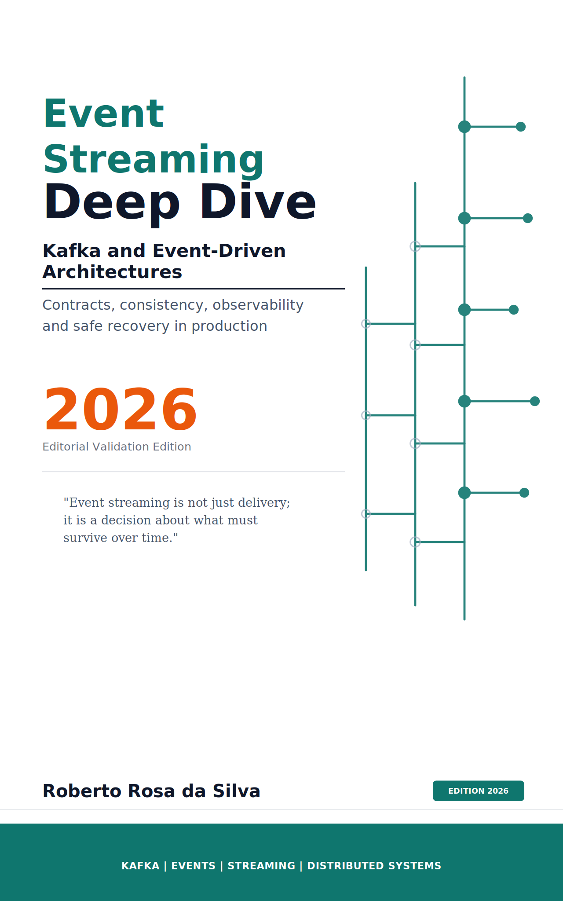

# Event Streaming Deep Dive - Real Project



Executable project synchronized with the **Event Streaming Deep Dive** manuscript. This module turns the book's narrative into a Spring Boot application that receives raw order events, applies validation and idempotency in the domain, and republishes only curated events to the next pipeline stage.

## Problem overview

In the OrderFlow universe, incidents rarely start because the broker is down. They start when the same business fact arrives late, duplicated, or out of order, and each service reacts as if it were seeing a different truth. The goal of this project is to show how to reduce this kind of operational inconsistency by treating event streaming as a discipline of contracts and business effects, not as generic asynchronous integration.

Here, the event represents a completed order fact. The application consumes that fact from the input topic, validates whether the minimum contract is consistent, checks for duplicates before applying effects, and only then publishes the event to a curated topic. The central point is simple: throughput without semantics only accelerates incidents.

## What this project demonstrates

- policy and validation patterns to separate business decisions, contract validation, and effect control;
- SOLID principles applied in the application core to keep cohesion, testability, and low coupling;
- event-driven architecture with ingestion, curation, and publication of business facts through Kafka;
- OCP in flow evolution, allowing new policies, validations, and adapters without breaking the central use case.

## Technical flow

1. The Kafka listener consumes messages from the `order.events.raw` topic.
2. The JSON payload is deserialized into the `OrderEvent` contract.
3. The use case validates the event and rejects inconsistent inputs.
4. The idempotency policy checks whether the `eventId` has already been processed.
5. New events are published to the `order.events.curated` topic.
6. The event identifier is recorded to prevent reprocessing with duplicated effects.

This flow mirrors the book's central thesis: serious consumers do not assume perfect delivery. They protect effects, make business rules explicit, and treat replay as a controlled capability, not as an operational lottery.

## Stack and assumptions

- Java 17;
- Spring Boot 3.3;
- Spring Kafka;
- Actuator for health, metrics, and Prometheus;
- Kafka broker reachable at `localhost:9092`.

The project's default properties configure the `event-streaming-orderflow` consumer group, reading from the earliest available offset, and exposing the `health`, `info`, `metrics`, and `prometheus` endpoints.

## Code organization

- `src/main/java/br/com/orderflow/eventstreaming/domain/model`: event contract and ingestion result.
- `src/main/java/br/com/orderflow/eventstreaming/domain/port`: domain input and output ports.
- `src/main/java/br/com/orderflow/eventstreaming/domain/usecase`: event ingestion use case.
- `src/main/java/br/com/orderflow/eventstreaming/domain/policy`: idempotency policy.
- `src/main/java/br/com/orderflow/eventstreaming/domain/validation`: event business validations.
- `src/main/java/br/com/orderflow/eventstreaming/domain/exception`: business exceptions.
- `src/main/java/br/com/orderflow/eventstreaming/application/kafka`: Kafka inbound adapter.
- `src/main/java/br/com/orderflow/eventstreaming/infra/adapter`: outbound adapters for Kafka and in-memory storage.
- `src/main/java/br/com/orderflow/eventstreaming/infra/config`: topic configuration and technical properties.

## Event contract

The expected payload represents an order fact with minimal traceability for validation and duplicate control:

```json
{
  "eventId": "evt-2026-0001",
  "orderId": "ord-9001",
  "customerId": "cst-42",
  "totalAmount": 199.9,
  "occurredAt": "2026-05-28T10:15:30Z"
}
```

Empty fields, invalid monetary values, or repeated events must not produce new effects. That is the difference between processing messages and protecting the business.

## How to run

Before starting the application, make sure a Kafka broker is listening on `localhost:9092`.

```bash
mvn clean test
mvn spring-boot:run
```

If you want to quickly validate the design before running everything, the first command already covers two critical points: use case behavior under duplication and preservation of hexagonal boundaries with ArchUnit.

## What to watch during tests

- if the same `eventId` reappears, the event is marked as duplicated and is not republished;
- if the contract arrives inconsistent, validation fails before touching infrastructure;
- as the application grows, the domain must remain isolated from Spring, and the application layer must not depend directly on `infra`.

These are exactly the deviations the book treats as recurring in production: retries without criteria, poorly defined events, and coupling disguised as event-driven architecture.

## Relationship to the book

This repository is the reference source code for the manuscript **Event Streaming Deep Dive: Kafka and Event-Driven Architectures**. The README follows the same editorial vocabulary as the book: contract before code, business key before throughput, and idempotency as a mandatory requirement when there is risk of replay, delay, or duplicate delivery.

If you are reading the manuscript in parallel, use this project as a lab to observe the transition from concept to implementation: the chapter explains why the journey diverges, and the code shows where that divergence starts to be controlled.
